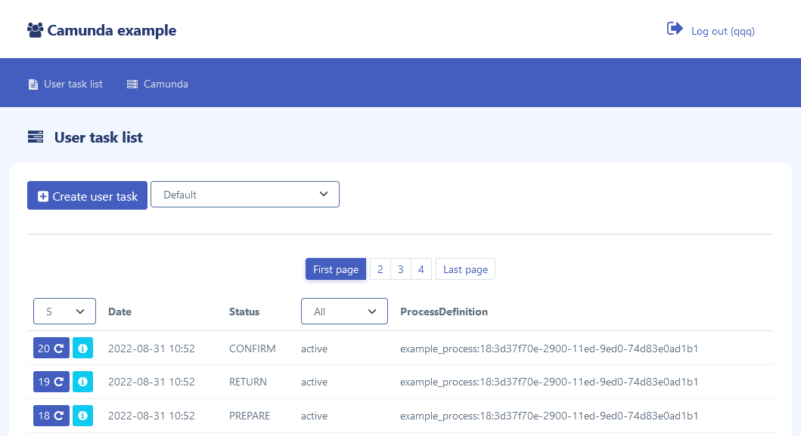

# Camunda java api

Java 17, Spring boot 2.7, Camunda 7.17
#### Simple project with camunda process engine, without camunda rest api
[](#title)

#### Project images
https://github.com/noadavis/camunda-java-api/tree/main/images

## Project configuration
```sh
copy src/main/resources/application_basic.yml to src/main/resources/application.yml
change settings:
  spring.datasource.url
  spring.datasource.username
  spring.datasource.password
```

## Project build

```sh
maven clean package
```

## Project Run

```sh
java -jar target/camunda.jar
```

## Project database
```sh
After the first launch of the project, start importing dictionaries from MYSQL.sql file
```

## Project user
```sh
Create new user on Registration page
```

## Project camunda process
```sh
import bpmn/process.bpmn on menu -> Camunda -> Loaded processes -> Upload new process
```